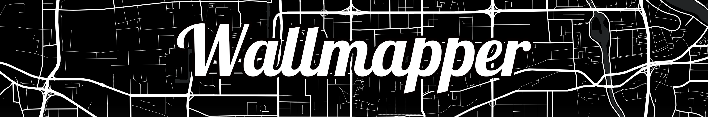

<h1 align=center></img></h1>

  
  
  
   
  
  
  
  
  
  

Generate wallpaper from map 
Under development 

## Description
A web application to create wallpaper from map, in some special map styles.

Finally I can change my wallpaper again, after two years.  
[Read more](https://lucka.moe/2018/07/23/wallmapper/ "Wallmapper | Lucka")Chinese

### Style List
- [Color](https://api.mapbox.com/styles/v1/lucka-me/cjk2n7ybobuuk2smu9zwlugy9.html?fresh=true&title=true&access_token=pk.eyJ1IjoibHVja2EtbWUiLCJhIjoiY2poa2xyN3J4MGJ0bTM3bjV5bjdvNDh3ZSJ9.QztckHrHyEuKp5_pVXmpIw) by [@lucka-me](https://github.com/lucka-me)  
  A new style that allows users to set their own colors for land, water, city and roads with Color Panel.
- [Dark](https://api.mapbox.com/styles/v1/lucka-me/cjjvmr0mn5csl2rmx5cbgmb0y.html?fresh=true&title=true&access_token=pk.eyJ1IjoibHVja2EtbWUiLCJhIjoiY2poa2xyN3J4MGJ0bTM3bjV5bjdvNDh3ZSJ9.QztckHrHyEuKp5_pVXmpIw) (Default) by [@lucka-me](https://github.com/lucka-me)  
  First style. Black ground, white roads, deep gray water, and nothing else. Suitable for AMOLED.
- [Hack](https://api.mapbox.com/styles/v1/lucka-me/cjjzm06vz0cwl2rnnzgdgkf7j.html?fresh=true&title=true&access_token=pk.eyJ1IjoibHVja2EtbWUiLCJhIjoiY2poa2xyN3J4MGJ0bTM3bjV5bjdvNDh3ZSJ9.QztckHrHyEuKp5_pVXmpIw) by [@lucka-me](https://github.com/lucka-me)  
  Map in terminal way: background in black, roads and annotation in light green.
- [Standard](https://api.mapbox.com/styles/v1/lucka-me/cjk2hmfmi3soj2rqfgr140hqp.html?fresh=true&title=true&access_token=pk.eyJ1IjoibHVja2EtbWUiLCJhIjoiY2poa2xyN3J4MGJ0bTM3bjV5bjdvNDh3ZSJ9.QztckHrHyEuKp5_pVXmpIw) by [@samanpwbb](https://github.com/samanpwbb)  
  A style from [Mapbox designers](https://www.mapbox.com/designer-maps/), inspired by early 20th century Standard Oil Company road maps.

## Requirement
- [Lucka's CSS](https://github.com/lucka-me/toolkit/tree/master/Web/CSS)  
  Provides basic stylesheet for the page.
- [Mapbox](https://www.mapbox.com/)  
  Provides style of the map and also map data from [OpenStreetMap](https://www.openstreetmap.org/)
- [Leaflet](https://leafletjs.com/examples/quick-start/)`0.2.x`  
  Provides way to display the map
- [leaflet-image](https://github.com/mapbox/leaflet-image)`0.2.x`  
  Provides way to convert map to image
- [Mapbox GL JS](https://www.mapbox.com/help/how-web-apps-work/#mapbox-gl-js-1)`0.3+`  
  Provides way to display the map

## Known Issues
- In IE, Download is unavailable

## To-Do
- [x] Fix the boundary of output image to the displayed
- [x] Select map style
- [ ] More map styles
- [x] Set center and zoom level
- [x] Fix download issue in Chrome
- [x] Fix `toBlob` unsupported issue in Edge and IE

## Changelog
See [CHANGELOG.md](./CHANGELOG.md).

## License
The source code are [licensed under MIT](./LICENSE).

Please notice that the Mapbox Token included in the source code is owned by [Lucka](https://github.com/lucka-me) and **ONLY** for public useage in [the demo pages](http://lucka.moe/Wallmapper/).
